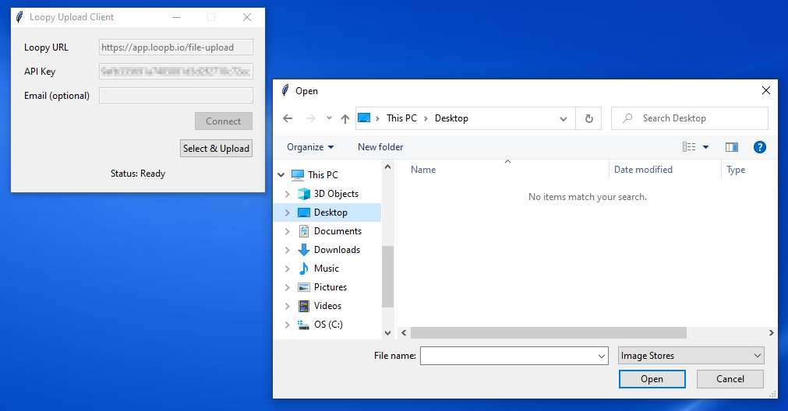

# loopy-upload-tuspy-client

Pure python implementation of TUS resumable upload protocol compatible and suitable for video uploads to
[loopy](http://loopbio.com/loopy/) accounts on http://app.loopb.io and elsewhere.

The `tuspy` file may also be used with other compatible TUS servers.

The `loopyupload` file implements loopy-specific authentication and can be used to upload files and
imgstores to your loopy account.

For non-loopy uses, or if you require any additional features not present in this python implmentation,
please check out the official upstream client https://github.com/tus/tus-py-client/

This 2-file library/implementation may be copy-pasted into your project.

The library supports both Python2 and Python3. The only dependecy is the
`python-six` pacakge.

## Example

```python
from loopyupload import LoopyTusUploader

uploader = LoopyTusUploader('https://your-loopy-onsite-server.com/file-upload',
                            headers={'X-API-Key': '123456abcdef123456abcdef123456ab'})
uploader.upload('/path/to/video.mp4')

```

## GUI Uploader

We have created a standalone GUI installer for uploading movies and imgstores on Mac and Windows to
[Loopy online video analysis](http://loopbio.com/loopy/). On Linux you can run the GUI from the git checkout using `python gui.py`.



#### Installation

* (On Windows 10)
  * download the [latest release](https://github.com/loopbio/loopy-upload-tuspy-client/releases) `LoopyUpload.exe` file
  * double click on the executable
  * bypass or agree to any security dialogs which try to prevent you from running unsigned
    applications or applications from unknown developers
* (On Mac 10.14/10.15)
  * download the [latest release](https://github.com/loopbio/loopy-upload-tuspy-client/releases) `LoopyUpload.zip` file
  * extract the zip file to a `LoopyUpload.app` file
  * right click on the `.app`. file and click open. you may be prompted to enter an
    administration password to allow running unsigned
    applications or applications from unknown developers
  * note: OSX 11.X version is not yet supported

#### Usage

* enter your API key from your account details page on http://app.loopb.io
* if you are uploading to a [loopy on-site](http://loopbio.com/loopy/#onsite) instance then adjust the _Loopy URL_ to match that you were provided by loopbio or your
  IT administrator

## LICENSE
MIT, based on https://github.com/cenkalti/tus.py


